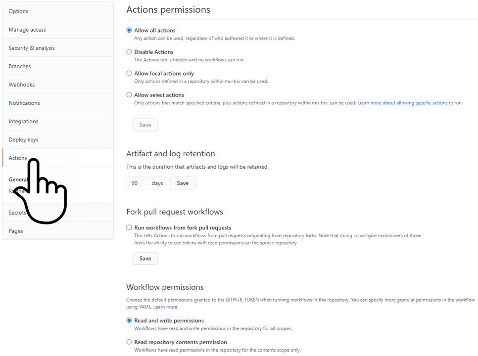
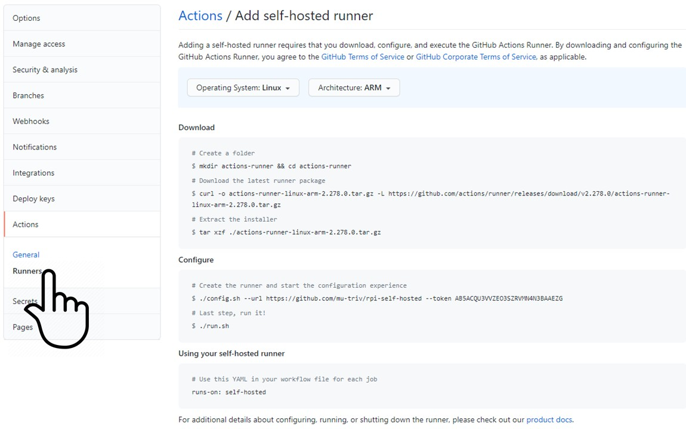
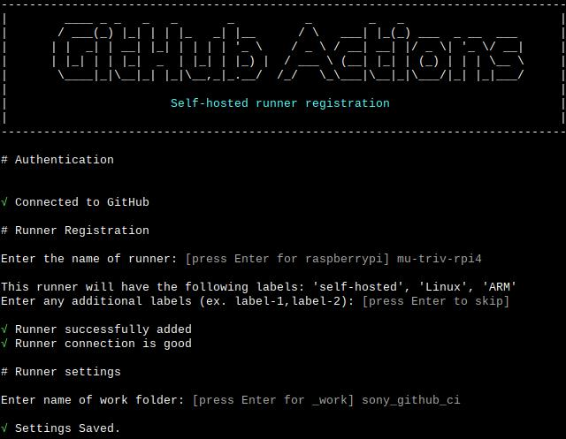
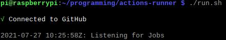

# Self-hosted GitHub Runner for the Raspberry PI 4B 8Gb

## Add self-hosted runner

> We can only add a self-hosted runner when we are the owner of the project.

> Execute the above commands on the machine which is destinated to be the runner

Successfull configuration the runner shows:

## Run the runner

